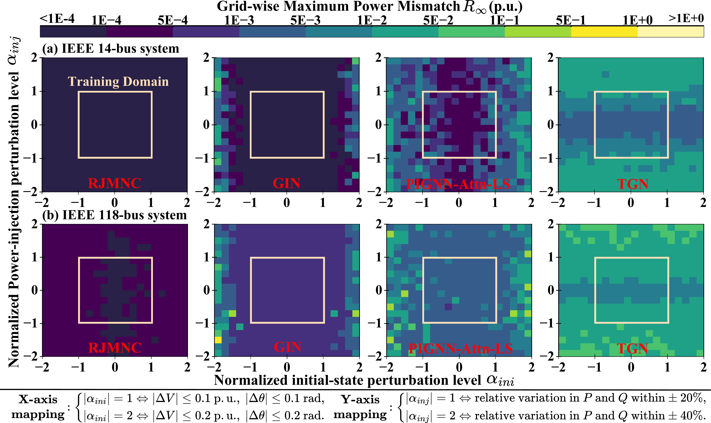
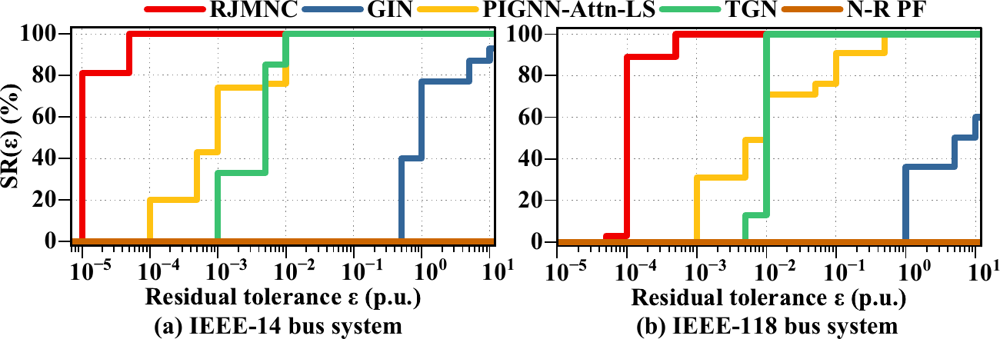

# RJMNC: Simulation Code and Results

This repository releases the **complete source code and reproducibility materials** for **Residual-Guided Jacobian-Aware Multi-Step Neural Correction for AC Power Flow**. It includes the proposed RJMNC solver, all reported comparison methods, data-generation code, dataset documentation and full-data links, trained checkpoints, evaluation CSV files, training/test logs, ablation artifacts, and manuscript figures.

## Complete reproducibility package

This release provides the full experimental pipeline rather than model weights alone:

- **Complete implementations:** source code for RJMNC, GIN, TGN, and PIGNN-Attn-LS is included.
- **Transparent data construction:** the C++ generator, raw IEEE system inputs, CSV schema, reduced examples, and links to the complete paper datasets are provided.
- **Traceable experiments:** training/evaluation configurations, checkpoints, detailed logs, in-distribution/operating-condition-extrapolation result CSV files, and N–R-selected numerical-divergence stress-test results are retained for both IEEE-14 and IEEE-118.
- **Controlled validation:** single-component ablation checkpoints and logs make the contribution of Jacobian updates and phase conditioning directly inspectable.
- **Publication materials:** the principal result figures are available in both vector PDF and GitHub-renderable PNG formats.

Together, these materials allow the implementation, data path, experimental protocol, and reported results to be inspected end to end.

## Repository layout

| Path | Contents |
| --- | --- |
| [`RJMNC/`](RJMNC/) | Proposed residual-guided, Jacobian-aware multi-step neural correction method. |
| [`RJMNC/Ablation/`](RJMNC/Ablation/) | IEEE-118 ablation checkpoints, logs, and result CSV files. |
| [`GIN/`](GIN/) | Global-Receptive Graph Iteration Network baseline. |
| [`TGN/`](TGN/) | Typed Graph Network baseline. |
| [`PIGNN-Attn-LS/`](PIGNN-Attn-LS/) | Physics-informed GNN with attention and Armijo line search. |
| [`Data/`](Data/) | Reduced IEEE-14 and IEEE-118 CSV datasets illustrating the required format. |
| [`Data_Generation/`](Data_Generation/) | C++ dataset generator and raw IEEE system files. |
| [`Figs/`](Figs/) | Principal result figures in vector PDF and GitHub-renderable PNG formats. |

The committed datasets are reduced examples for inspecting the CSV schema and code interface. The included checkpoints, logs, and result CSV files correspond to the complete experimental datasets linked in [`Data/README.md`](Data/README.md); data construction is documented in [`Data_Generation/README.md`](Data_Generation/README.md).

## Environment

Python 3.10 or later is recommended. The main dependencies are:

```bash
pip install numpy pandas torch torch-geometric torch-scatter
```

Install PyTorch, PyTorch Geometric, and `torch-scatter` builds compatible with the local CUDA version. CPU execution is supported but is considerably slower. The C++ generator additionally requires a Windows x64 build environment and NICSLU; see the data-generation README for details.

## Running the code

The proposed method is configured near the top of `RJMNC/main.py`. Set `node_chose` and `system_nodes` to `IEEE_14`/`13` or `IEEE_118`/`117`. Use `test_flag = False` for training and `test_flag = True` to evaluate the matching checkpoint in `RJMNC/ckpt/`.

```bash
cd RJMNC
python main.py
```

The baselines use command-line arguments. From the repository root, the included IEEE-118 checkpoints can be evaluated with:

```bash
python GIN/main.py --data_dir Data/IEEE_118
python TGN/main.py --data_dir Data/IEEE_118
python PIGNN-Attn-LS/main.py --data_dir Data/IEEE_118 --eval_only
```

Replace `IEEE_118` with `IEEE_14` for the smaller system. To train GIN or TGN, pass `--load_trained_model false`; to train PIGNN-Attn-LS, omit `--eval_only`. Use `python <script> --help` for the remaining baseline settings.

## Agreement with reference power flow

The following errors compare RJMNC predictions with the converged reference PF solutions over all 4,000 in-distribution and operating-condition-extrapolation test cases. For each case, the maximum absolute bus error is computed first and then averaged across cases; the worst column is the maximum over the full test grid.

| System | Mean max \|voltage-angle error\| (rad) | Worst max \|voltage-angle error\| (rad) | Mean max \|voltage-magnitude error\| (p.u.) | Worst max \|voltage-magnitude error\| (p.u.) |
| --- | ---: | ---: | ---: | ---: |
| IEEE-14 | 3.779437e-05 | 1.780391e-04 | 7.712007e-06 | 3.778934e-05 |
| IEEE-118 | 3.304407e-04 | 1.998097e-03 | 7.652134e-06 | 3.814697e-05 |

Voltage-angle errors cover all non-slack buses; voltage-magnitude errors cover PQ buses, consistent with the model evaluation code. Values are summarized directly from [`IEEE_14.pt.log`](RJMNC/ckpt/IEEE_14.pt.log) and [`IEEE_118.pt.log`](RJMNC/ckpt/IEEE_118.pt.log). Their small magnitude shows that the proposed solver follows the corresponding PF solutions closely.

## Included outputs

Each method stores its artifacts under `ckpt/`. A `.pt` file is a trained checkpoint, `.pt.log` records training and evaluation, `<system>.csv` contains cell-wise in-distribution/extrapolation results, and `<system>_ill.csv` contains the N–R-selected numerical-divergence stress-case mismatch summary.

> **Naming note:** `_ill` and `source=ill-conditioned` are historical identifiers retained for compatibility with the experiment scripts. They refer to the manuscript's N–R-selected numerical-divergence stress set, not to a Jacobian-condition-number label. The current selection rule is given in [`Data_Generation/README.md`](Data_Generation/README.md).

## Result figures

### In-distribution and operating-condition extrapolation

[](Figs/Graph1.pdf)

Cell-wise maximum nodal power mismatch, $R_\infty$, for RJMNC and the compared learning-based baselines on the IEEE-14 and IEEE-118 test grids. Click the image to open the vector PDF.

### N–R-selected numerical-divergence stress test

[](Figs/Graph2.pdf)

Success rate, $\mathrm{SR}(\varepsilon)$, versus residual tolerance for the IEEE-14 and IEEE-118 stress cases. Click the image to open the vector PDF.
